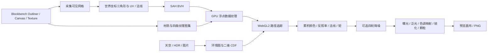

# 路径追踪插件逆向记录

## 入口与生命周期

原始文件是一个 IIFE，最后通过 `BBPlugin.register('pathtracer', …)` 注册 Blockbench 插件，版本为 `1.5.1`。`onload` 从 `localStorage` 读取设置，注入样式，创建菜单动作并订阅 `finished_edit`、`undo`、`redo`。菜单动作打开独立 `Dialog`。`onunload` 停止帧循环，销毁 WebGL 资源、窗口、动作、样式和监听器。

设置存于 `pathtracer_preview_settings`。逐纹理覆盖也保存在这个对象的 `__overrides` 字段；剪贴板配置导入导出只处理全局默认设置。HDR/图片环境的像素数据没有持久化，重新加载后若没有图像数据则回退到程序化天空。

## 渲染数据流

`collectGeometry()` 读取可见 Outliner 元素对应的 Three.js 网格，以世界矩阵变换顶点和法线，并按面解析纹理。退化三角形被跳过。负尺寸方块及镜像变换会记录额外标志，以保持面剔除方向。`buildMaterials()` 按纹理 UUID 去重，把颜色、MER、法线、自发光纹理放到各自的方形图集，生成材质参数纹理。`buildBVH()` 以 12 个分箱估算表面积代价；叶节点一般含少量三角形。

场景时间由 `day-cycle.js` 统一换算为太阳方位与高度、天空亮度和色调、日落暖色及太阳强度。生成的天空和导入的 HDR/图片环境都使用同一日夜曲线；Blockbench 场景预览也同步更新环境光和雾。时间变化时重新生成环境数据并清空采样累积，导入图像的原始像素保持不变。

`PathTracer.buildScene()` 按 BVH 顺序重排三角形，上传顶点、属性、BVH、材质、图集和发光三角形索引。`setEnvironment()` 为程序化天空或导入的等距柱状图生成环境纹理，另构建条件 CDF 与边缘 CDF，用于环境光重要性采样。

## GPU 数据布局

所有几何数据都以 `RGBA32F` 纹理提供给片元着色器，默认宽度是 1024 texel。着色器通过线性索引换算纹理坐标。

| 数据 | 每项 texel 数 | 内容 |
| --- | ---: | --- |
| 三角形位置 | 3 | 三个顶点；第 1 个 texel 的 `w` 是材质槽，第 2 个的 `w` 是剔除标志 |
| 三角形属性 | 4 | 三个顶点法线、UV，最后一个 `w` 标记发光三角形 |
| BVH 节点 | 2 | `min.xyz` + 左子节点索引或叶起点；`max.xyz` + 叶三角形数，内部节点的该值为 0 |
| 材质 | 5 | 色调/标志、图集矩形、粗糙度/金属度/发光/IOR、透射/Alpha/法线强度、发光颜色 |

BVH 内部节点的右子节点紧随左子节点。叶起点指向已经按 BVH 顺序排列的三角形。材质标志位控制颜色、MER、法线、自发光图和纹理环绕等采样路径。颜色数据在着色器里从 sRGB 转成线性空间。

## 着色器和逐帧流程

渲染器需要 WebGL2 与 `EXT_color_buffer_float`。每次 `renderPass()` 用全屏三角形执行一个样本，两个 FBO 交替累积颜色、反照率、法线与亮度矩。反照率附件的 alpha 累积粗糙度，法线附件的 alpha 累积材质槽标识，供降噪识别镜面像素和材质边界。主着色器遍历 BVH，支持三角形相交、Alpha 裁剪/随机混合、GGX 材质、透射、发光面、太阳和环境光采样、地面与阴影捕捉。交互期间降低分辨率与反弹数；空闲时按帧耗时自适应增加每帧样本数。

`present()` 的顺序是四轮跨尺度降噪（可选）→ HDR 合成与曝光 → 泛光提取和水平/垂直模糊（可选）→ 色调映射、饱和度、对比度、暗角 → 锐化和颗粒。降噪跳过背景和低粗糙度的镜面像素，并将材质槽差异纳入邻域权重，以保留环境贴图、反射和材质边缘细节。色调映射包括 Reinhard、ACES、Filmic、AgX。水印绘制在最终的 2D 画布上，保存 PNG 时也合成进去。

## 最终渲染与 GPU 缓冲

预览画布的每边受 `MAX_RENDER_BUFFER_SIDE`、`MAX_TEXTURE_SIZE` 和 `MAX_RENDERBUFFER_SIZE` 中的最小值约束。最终导出不把整幅高分辨率图像放进 GPU 渲染缓冲：`TiledRender` 按最多 768 像素的核心区域逐块采样，依据 GPU 尺寸上限再缩小区块，并为降噪、泛光和锐化扩展边缘范围。滤镜完成后裁掉扩展区域，将核心部分写入完整尺寸的 2D 输出画布。GPU 缓冲因而只需容纳当前区块；输出画布仍按最终图片尺寸占用系统内存。

`RenderBuffers` 按基础、降噪、泛光分组跟踪纹理与帧缓冲分配。只有启用对应效果时才创建降噪或泛光缓冲；关闭效果、发生初始化错误或销毁渲染器时释放对应资源。调整最终采样数会清空输出并从第一块重新开始，避免不同目标采样数的区块混入同一张图。

`buildMaterials()` 只将实际自发光材质视为发光体，不再把 Blockbench 的非光照预览材质误判成物理发光面。对组或部件设置的自发光强度按绝对值应用；原生纹理发光及逐纹理设置仍受全局发光强度控制。

## 设置变化与刷新成本

`CHANGE_KIND` 把设置分为四类：`post` 只重新显示已累积的画面，`resize` 重建帧缓冲，`env` 重新生成环境图并清空累积，`scene` 延迟重建几何/材质。其余设置清空累积后继续采样。模型编辑事件在自动重载开启时延迟重建场景，否则只标记画面已过期。

## 兼容与边界

- 原文件标记为桌面和网页都可用，但渲染必须有 WebGL2 和浮点颜色缓冲扩展。
- 纹理图集会受 `MAX_TEXTURE_SIZE` 和代码中的 8192 上限约束；超出时抛出错误。
- HDR 解析器支持 Radiance RGBE，尺寸行只接受 `-Y +X` 顺序。
- `reference/pathtracer.js` 是未改动的原文件；最初的构建产物曾与其字节一致。当前开发源码位于 `plugins/georenderer/src/`，由 esbuild 生成 `plugins/georenderer/georenderer.js`。
